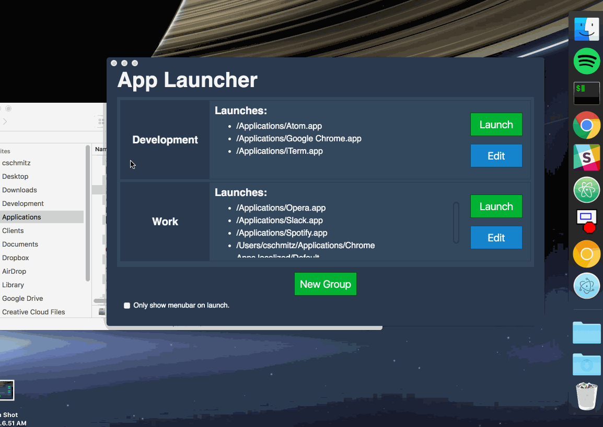
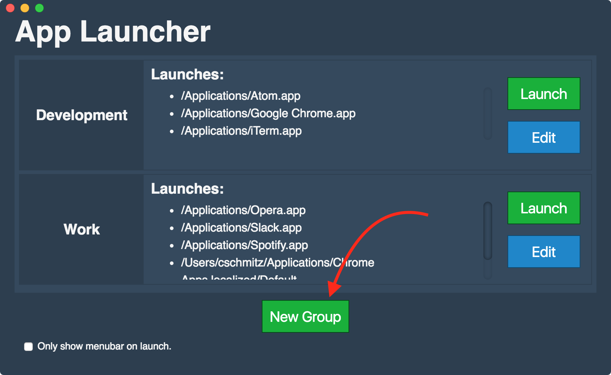
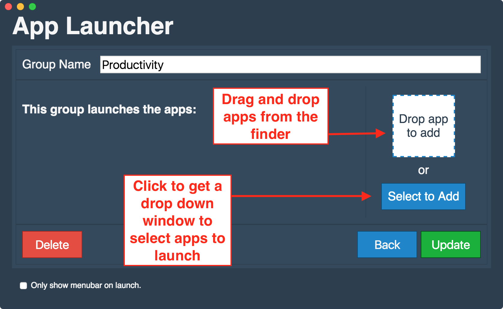
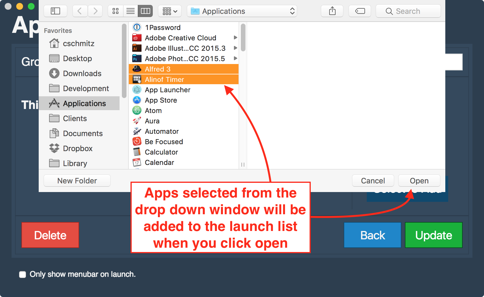
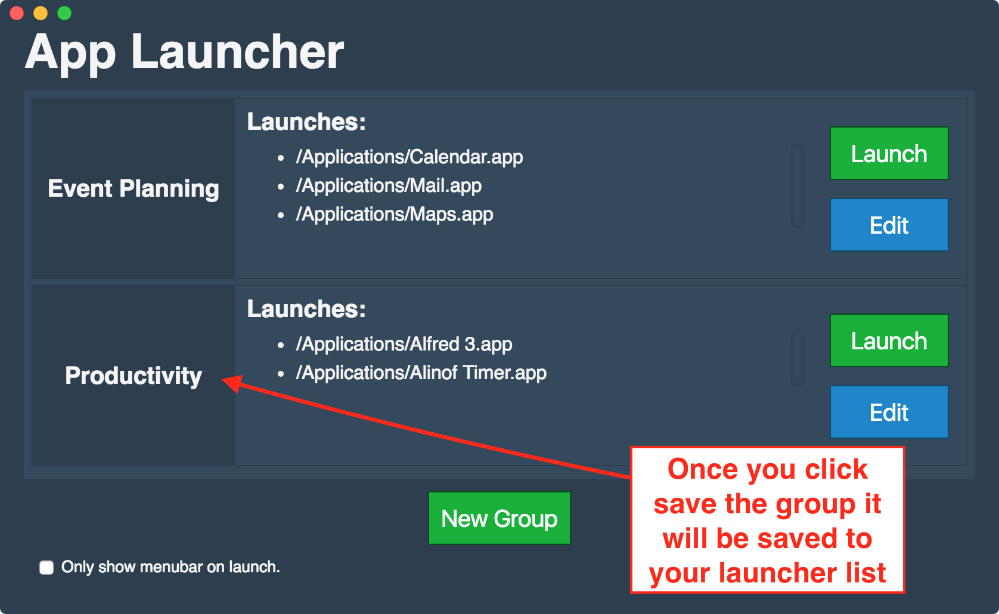
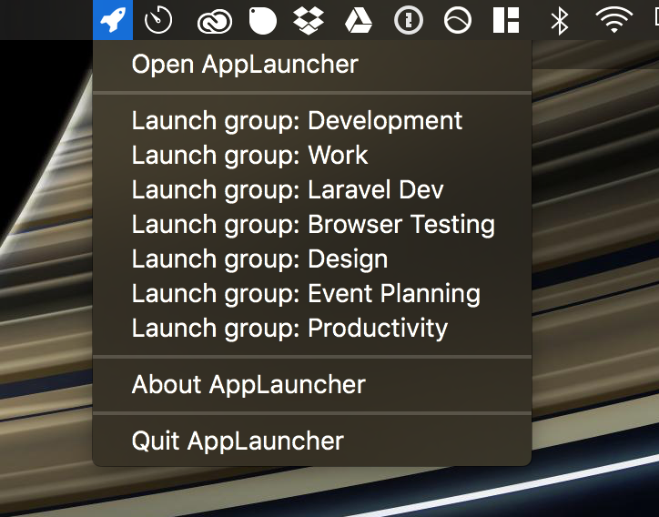
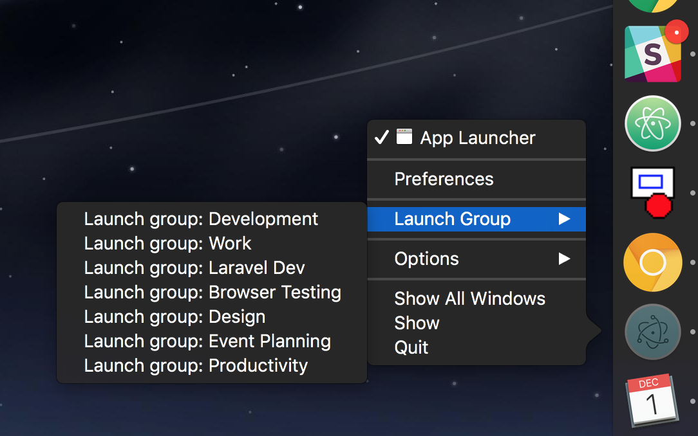
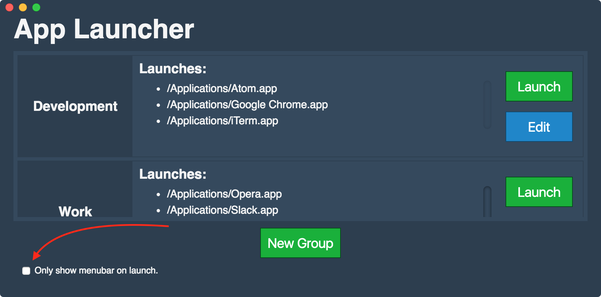

# App Launcher

> Launch app groups by name.



The App Launcher is a Mac OS app built with [Electron](http://electron.atom.io/) and [Vue.js](https://vuejs.org/). The app allows you to create groups of apps that can be launched by group name. [You can download the app here](https://github.com/chris-schmitz/app-launcher/releases/tag/v0.3-beta).

## Creating Groups

To add a new group, click the "New Group" button.



This will take you to the group details screen. From here you can name the group and add apps by either drag and dropping them or by picking them from a drop down selection window.




Once you've picked the apps you want to launch for the group, click "Update" to save the group. This will add the new group to your launchable list.



Once you've created your groups you can launch them from the tray icon:



Or from the dock icon context menu:



Once you've configured the groups you can hide the app's window by clicking the "Only show menubar on launch" option and closing the window.



When you close the window the app will sit in the background and wait for you to launch a group from the tray or dock icon.

# Development setup

### Starting up vue

I'm using [Vue.js](http://www.vuejs.org) for the interface and I'm using webpack's `vue-loader` to break out the components into their own `.vue` files. To get up and running with Vue development do the following:

``` bash
# from the root of the project

# install dependencies
npm install

# serve with hot reload at localhost:8080
npm run dev

# build for production with minification
npm run build
```
Once you've run these commands webpack will start listening for changes to the interface files and will compile the code on those changes.

### Starting electron

Since the GUI for this project is written in [Electron](http://electron.atom.io/) you'll need to run electron's binary to develop this project:

```
# from the root of the project
electron .
```

This will launch the electron app window. You'll be able to work in the electron window as you would normally in a browser window.


## Misc details
- Color pallet used: [OnyxCF from http://www.color-hex.com/](http://www.color-hex.com/color-palette/25343)


## To do list

- "Unsaved changes, sure you don't want to save?" message on save/update group
    - Build a window component to do the confirmation.
- "Restore" ability when editing group props but before save
- Custom sorting of app list
