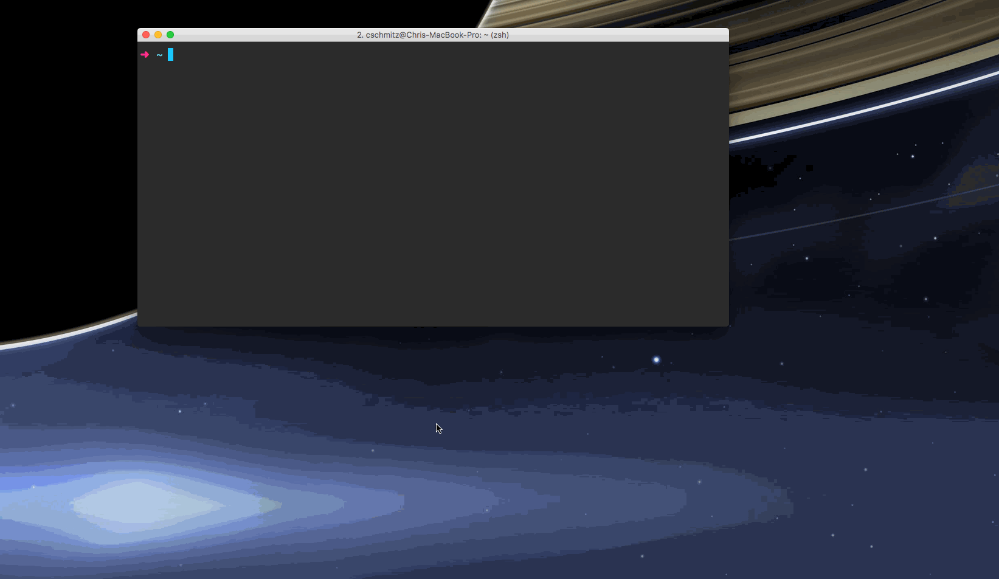

# App Launcher

A node cli tool to launch applications per specified location.

## Installation

- Clone or download the repository
- Open a terminal and `cd` into the root of the project
- Install the dependencies

        npm install
        # or
        yarn install

- Create a `config.js` file at the root of the project
    - You can do this by changing the name of `example.config.js` if you'd like
- Review `example.config.js` for location configuration details
- Use npm to link the binary

    npm link
